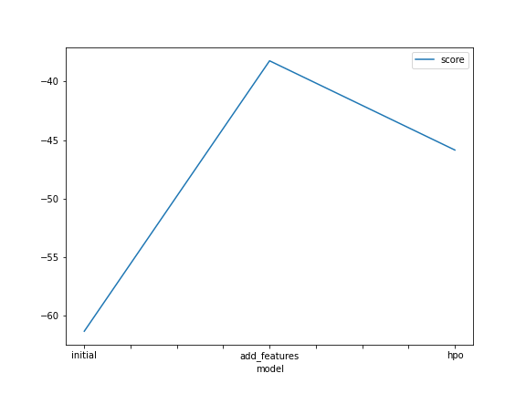
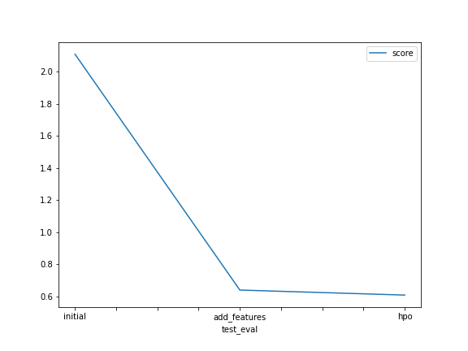

# Report: Predict Bike Sharing Demand with AutoGluon Solution
#### MICHAEL GOBOOLA

## Initial Training
### What did you realize when you tried to submit your predictions? What changes were needed to the output of the predictor to submit your results?
The output of the predictor include negative values which are not allowed in the submission set, so one need to replace the negatives with 0s to meet the required 
the submission standard.

### What was the top ranked model that performed?
The model is LightGBMXT_BAG_L2

## Exploratory data analysis and feature creation
### What did the exploratory analysis find and how did you add additional features?
it found that there is a linear relationship between the feature values, with the addtional features including the datetime I did a one hot encoding for the weather and season.
then also made categories of the temp and windspeed, into 3 categrories and then added a one hot encoding of the resulting features.

### How much better did your model preform after adding additional features and why do you think that is?
The model improved drastically from and rmse of -61 to on of -38 and alos the kaggle socre improved from 2.78 to 0.577

## Hyper parameter tuning
### How much better did your model preform after trying different hyper parameters?
Honestly the models never changed that much, with imrovement of about 0.002 approximately, 
though the recommendation is that hyperparemter tuning is not always optimal to extract more performance from the models.

### If you were given more time with this dataset, where do you think you would spend more time?
I will spend more time on feature engineering to create moe relevant features and also hyperparameter tuning so that I can establish which ones affect the models performance directly 

### Create a table with the models you ran, the hyperparameters modified, and the kaggle score.
|LightGBM|num_boost_round|max_base_models_per_type|max_base_models|score|
|--|--|--|--|--|
|initial|5|5|25|2.10797|
|add_features|5|5|25|0.6398|
|hpo|10|5|25|0.6085|

### Create a line plot showing the top model score for the three (or more) training runs during the project.

### Create a line plot showing the top kaggle score for the three (or more) prediction submissions during the project.

## Summary
In conlusion, adding new features to the model, improved it grately, but hyperparameter tuning doesnt improve the model well enough as one would want, and its really recommended for begineers 
to tune hyperparameters.